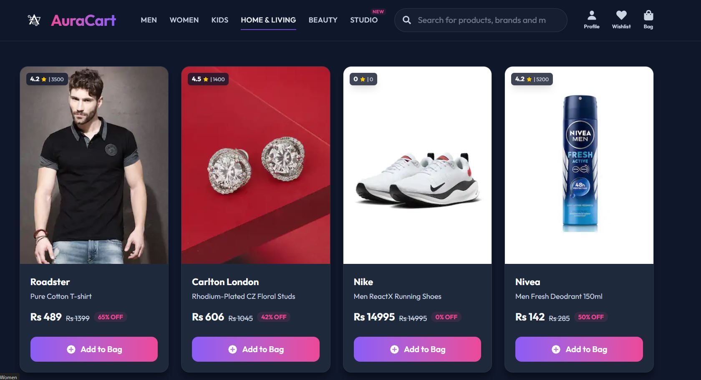

# 🛍️ AuraCart - Premium E-Commerce Platform



Welcome to **AuraCart**, a fully functional, premium e-commerce web application designed to deliver a modern and luxury shopping experience. This project serves as a showcase of modern frontend development, state management, and responsive design, built as part of my Project Showcasing Journey (Project 28 of 29).

---

## ✨ Features

- **Modern Luxury UI:** A visually stunning, monochrome and gold-themed design built with Tailwind CSS, utilizing glassmorphism and smooth micro-animations.
- **Dynamic Category Filtering:** Easily navigate between Men, Women, Kids, Home & Living, and Beauty sections using URL search parameters.
- **Real-Time Search:** Instantly find products with an integrated search bar that updates results dynamically.
- **Shopping Cart Management:** Add and remove items from your bag, with automatic calculations for total price, discounts, and convenience fees.
- **Robust State Management:** Powered by Redux Toolkit for efficient global state handling (shopping bag, items, and fetching status).
- **Resilient Data Fetching:** Seamless fallback to local mock data if the backend server is temporarily unavailable, ensuring a zero-downtime user experience.
- **Responsive Layout:** Fully optimized to look and work perfectly on desktops, tablets, and mobile devices.

---

## 🛠️ Tech Stack

**Frontend Architecture & Libraries:**
- **React (Vite):** Fast, modern React framework for building the UI.
- **React Router v7:** Client-side routing for seamless page transitions and URL-driven state.
- **Redux Toolkit (`react-redux`, `@reduxjs/toolkit`):** Centralized global state management.
- **Tailwind CSS & PostCSS:** Utility-first CSS framework for rapid, highly customizable styling.
- **React Icons:** Scalable vector icons for a polished UI.

---

## 🚀 Installation and Setup

To get this project up and running on your local machine, follow these simple steps:

### Prerequisites
Make sure you have [Node.js](https://nodejs.org/) installed on your computer.

### Step 1: Clone the Repository
```bash
git https://github.com/Imtiaz-Ali17314/AuraCart-Premium-E-Commerce-Platform.git
cd AuraCart-Premium-E-Commerce-Platform/AuraCart-frontend
```

### Step 2: Install Dependencies
Install all required NPM packages:
```bash
npm install
```

### Step 3: Run the Development Server
Start the frontend application using Vite:
```bash
npm run dev
```
Open your browser and navigate to the local server URL (usually `http://localhost:5173`) to view the application.

---

## 📂 Project Structure

```text
📦 AuraCart-frontend
 ┣ 📂 public
 ┃ ┗ 📂 images            # Static assets like logos, banners, and the project preview
 ┣ 📂 src
 ┃ ┣ 📂 components        # Reusable React components (Header, Footer, BagItem, HomeItem, etc.)
 ┃ ┣ 📂 data              # Local fallback data (items.js)
 ┃ ┣ 📂 routes            # Page-level components (App, Home, Bag)
 ┃ ┣ 📂 store             # Redux slices and store configuration (bagSlice, itemsSlice, etc.)
 ┃ ┣ 📜 index.css         # Global Tailwind CSS configurations and custom styles
 ┃ ┗ 📜 main.jsx          # Application entry point and router setup
 ┣ 📜 package.json        # Project dependencies and scripts
 ┣ 📜 tailwind.config.js  # Tailwind CSS theme configuration
 ┗ 📜 README.md           # Project documentation
```

---

## 💡 Usage

1. **Browse Products:** Scroll through the home page to view the latest premium items.
2. **Filter & Search:** Click on the category links in the header (e.g., Men, Women) or use the search bar to find specific products.
3. **Manage Cart:** Click the "Add to Bag" button on any product. Click the bag icon in the top right to view your cart, see the price breakdown, and manage items.

---

## 🔮 Future Improvements

While AuraCart is a robust showcase of frontend capabilities, here are a few planned enhancements:
- **User Authentication:** Allow users to create accounts, log in, and save their order history.
- **Backend Integration:** Fully connect the frontend to a dynamic backend database (Node.js/Express & MongoDB) for live inventory management.
- **Payment Gateway:** Integrate Stripe or Razorpay to simulate the checkout process.
- **Wishlist Feature:** Allow users to save their favorite items for later without adding them to the cart.

---

## 📄 License

This project is open-source and available under the [MIT License](LICENSE). Feel free to clone, modify, and use it for your own learning and portfolio building!

---
*Built with ❤️ as Project 28/29 of my Project Showcasing Journey.*
